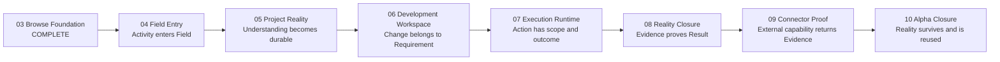

# Fielora Phase 04 → V0.1 Alpha Remap Candidate

状态：`HISTORICAL / SUPERSEDED FOR CURRENT EXECUTION ORDER`

> 2026-08-17 用户纠正开发顺序：近期先交付 Codex-like multi-provider desktop，再依次建立 stable long tasks、Aegis、DXE 与 Personal Steward。本文件保留 Phase 04 历史设计与证据语义，但不再控制当前开发路线。当前 canonical 方向见 `docs/product/RAPID_DESKTOP_EXECUTION_V0.1.md`。

版本：V0.1 Candidate 4 — Strategic Anchor, Permission & Phase 04 Capability Hardening

日期：2026-08-16

```text
CODEX_READING_REPORT: CONFIRMED
PHASE_04_ALPHA_REMAP: AUTHORIZED
PHASE_04_ALPHA_REMAP_CANDIDATE: ACCEPTED
CODEX_REALITY_OVERLAP: CONFIRMED
CODEX_HAS_FIELORA_STYLE_UNIFIED_REALITY_LAYER: NOT_CONFIRMED
COMPETITIVE_HARDENING: REQUIRED_BEFORE_FREEZE
COMPETITIVE_REBASE_2026_08_17: ACCEPTED_AS_ROUTE_CONSTRAINT
PRIMARY_DIFFERENTIATION_MECHANISMS: EXPLICIT_LIFECYCLE / OPERATIONAL_WORK_STATE / PERSISTENT_LINEAGE_VERIFICATION / DXE
RAPID_DESKTOP_REBASE_2026_08_17: SUPERSEDES_FUTURE_PHASE_EXECUTION_ORDER
STRATEGIC_ANCHOR: CONFIRMED
LONG_TERM_VISION: PERSONAL_DIGITAL_STEWARD
ALPHA_POSITION: WORK_REALITY_STEWARD
LIFE_STEWARD_EXPANSION: DEFERRED
PHASE_04_CAPABILITY_DEFINITION: ACCEPTED_FOR_FREEZE_INPUT
PHASE_04_FREEZE: GRANTED
PHASE_04_IMPLEMENTATION: EXECUTED
```

本文件只重排 Phase 04 到 V0.1 Alpha 的产品与工程路线。它不修改 Phase 01–03 已完成事实，不授权任何 Phase 04 产品代码、依赖、Migration 或 credential implementation，也不把候选设计写成 Frozen Contract。

Phase 04 的逐能力边界、Permission 分层、logical persistence、Slices、Gate 与 Freeze 前开放决定进一步收敛在 `PHASE_04_CAPABILITY_DEFINITION_CANDIDATE_V0.1.md`；该文件与本路线同为 Candidate，不是 Product/Contract/Schema/Implementation Freeze。

在用户审查并明确接受本候选前，`TECHNICAL_ARCHITECTURE_V0.1.md` 第 19 节和 `SCHEMA_FREEZE_V0.1.md` 的 Phase growth map 仍是冻结基线。本候选保留 04–10 编号与大部分既有表职责，以避免无必要的 schema renumbering；但提出一个必须显式审查的时序调整：`capabilities` / `capability_executions` 从原 Phase 08 候选职责提前到 Phase 07，先承载 Terminal/Run/Git 的受控执行，Phase 08 再建立 Verification/Reality Closure。该调整在 Candidate 获接受前不修改 Frozen Schema。具体 columns、commands、events、provider、vault、scanner、editor、PTY、artifact store 与 MCP transport 仍须在所属 Phase Freeze 时决定。

## 1. 重排目标

后续路线不再以“有没有 Browser / AI / Editor / Terminal / MCP”作为产品完成定义。每个 Phase 必须同时说明：

1. 新增了哪些基础能力；
2. 新增了哪些 Fielora 独有语义；
3. 最终证明哪一条可证伪的 Differentiation Hypothesis；
4. 用户通过哪个纵向流程感知该差异；
5. 哪些 Evidence 足以支持 Phase verdict；
6. 哪些能力明确不进入本阶段。

路线共同遵守：

```text
Capability
    ↓ belongs to
Field Reality
    ↓
Goal / Requirement / Decision
    ↓
Action
    ↓
Evidence
    ↓
Verified Result
    ↓
Resume
```

核心不变量：

- `Conversation is history; Field State is reality.`
- `Context informs the Agent; Reality governs the work.`
- `Action completed ≠ Result verified.`
- AI 产出默认不是事实、Decision 或 Verified Result；必须经过明确的 promotion、confirmation 或 verification lifecycle。
- Provider、Agent、Editor、PTY、MCP 与 Browser 都是 Adapter/Capability，不成为 Field Reality 的身份来源。
- 每个 Phase 交付 Portable；Installer checkpoints 继续是 Phase 08 与 Final Alpha。Phase 03 Installer 历史 checkpoint 的处置属于独立 closeout debt，不能伪装成 Phase 04 能力或静默后移。
- 任一 Phase Complete 不自动授权下一 Phase；下一阶段仍需单独 Freeze 与 Implementation Authorization。

### 1.1 Strategic Product Anchor

Phase 04 → Alpha 采用以下稳定战略层级：

```text
LONG_TERM_VISION
Personal Digital Steward
个人数字管家

        ↓

CORE_PROBLEM
Important work loses continuity and trustworthy state
across people, AI systems, tools and time.

        ↓

CORE_DIFFERENTIATION
Provider-neutral Reality
+ Governed Agency
+ Verification
+ Recovery

        ↓

ALPHA_POSITION
Work Reality Steward

        ↓

ALPHA_PROOF
One real undertaking remains understandable,
verifiable, safely actionable and resumable
across sessions, tools and model providers.

        ↓

LIFE_STEWARD_EXPANSION
DEFERRED
```

`trustworthy state` 不表示 Fielora 掌握绝对 Truth。它表示系统能明确表达当前承认的状态、依据、authority/confidence 与 lifecycle；Reality 可以包含 `FACT`、`DECISION`、`ASSUMPTION`、`QUESTION`、`BLOCKER`、`RESULT`、`UNKNOWN`、`STALE` 与 `SUPERSEDED`，并且冲突、修订和不确定性不得被静默抹平。

`Personal Digital Steward` 是长期北极星，不具有直接产生当前 Roadmap Item 的权限。Phase 04 → Alpha 的候选能力必须由 `Work Reality Steward` 过滤：只有证明可信工作状态能持续存在所必需的能力才进入当前路线。Calendar、Email、Weather、Shopping、Continuous Life 与通用 Computer Use 默认不进入 Alpha；只有某个冻结 Hero Flow 能证明不可替代依赖时，才可通过独立范围裁决重新考虑。

Alpha 不证明 Fielora 已经“像管家”，而证明它值得未来成为管家。极限证明必须覆盖不同 Provider 分别理解、开发和验证，Human 中途修订正式 Decision，应用重启，Requirement/source revision 改变，以及一次 `UnknownOutcome`；最终答案必须来自 Fielora-owned Reality，而不是重新读取历史聊天摘要。

### 1.2 Reality Competitive Boundary

当前公开产品事实确认 ChatGPT/Codex 已拥有 Projects、thread-scoped Goals、durable externalized state、Memories、Computer History、长任务执行与 evidence-driven agent loops。这些能力与 Fielora 的工作连续性存在显著重叠，因此“记住进度”“跨会话续做”“保存目标”“测试后继续修复”或“跨软件工作”均不得再作为独有差异。

公开资料只能支持“尚未证明存在 Fielora 所定义的统一 Reality domain”，不能反向声称其他产品内部绝对不存在相似机制。Fielora 的可证伪边界是：

```text
Context
  What should the Agent know?

Reality
  What does Fielora currently recognize,
  and what follows operationally from it?
```

Field Reality 至少必须同时证明八项 Contract：

1. **Identity**：Requirement、Decision、Evidence、Result 等拥有 Fielora-owned stable identity，不是 transcript 片段或 provider session identity；
2. **Type**：Fact、Inference、Assumption、Decision、Requirement、Evidence 与 Result 不混为一谈；
3. **Provenance**：保留 source、actor、time、target revision 与必要定位；
4. **Authority**：来源与权威性分离，user-confirmed、source-observed、model-inferred、tool-output 不自动等价；
5. **Lifecycle**：至少能表达 current、stale、superseded、retracted、invalidated 或所属 Phase 冻结的等价状态；
6. **Operational Effect**：Reality mutation 必须改变 Resume、允许的 Action、blocker、completion 或 re-verification 行为，而不是只修改 metadata；
7. **Verification Relation**：完成判断指向稳定 Criterion、Check、Evidence、target revision 与 Result；
8. **Provider Independence**：Provider、Agent、Conversation、Memory 或 opaque session 更换/缺失后，权威对象身份与行为约束仍保持。

前五项只能证明系统能严谨描述 Reality；后三项才证明 Reality 实际支配产品。若 Schema 看似结构化，但 Resume 仍从聊天总结、执行不检查当前状态，或 Requirement revision 改变后旧 Result 仍有效，则 Reality Contract 失败。

### 1.2.1 2026-08-17 Competitive Rebase

当前官方产品事实表明，ChatGPT Desktop/Codex 已把 Chat/Work/Codex、Projects、本地文件夹、Browser、文件工作、长任务、Computer Use 与 Plugins/MCP 放入同一桌面工作环境。`Field`、`Reality`、Resume、Memory、Coding、Browser、MCP、Agent、Permission、Multi-provider 与 Personal Steward 的名称或能力存在本身，均不得再作为差异声明。

官方公开资料没有证明 ChatGPT/Codex 拥有或缺少 Fielora 所定义的统一 Reality domain；路线只能验证 Fielora 自己的产品行为，不得用对竞品内部实现的猜测构造护城河。Computer History 的竞争方向值得纳入，但当前官方可用性仍限定在 macOS Desktop，并受计划、管理员与地区条件影响，不能写成 Windows 通用能力。

Phase 04 → Alpha 不重新编号，主差异 Gate 收窄为四项：

1. **Explicit Lifecycle**：`Capture → Inbox → Promote → Work → Result → Reuse`；
2. **Operational Work State**：状态 revision 改变必须真实改变有效性、Resume、Completion 或 Reverification；
3. **Persistent Work Lineage + Verification**：`Requirement → ChangeSet → Check → Evidence → Verified Result` 拥有稳定关系并随 revision 正确失效；
4. **DXE**：工作状态从固定 Surface Primitive 中决定当前工作面，用户不通过手工选择 Mode 模拟状态。

Provider-neutral Reality、Governed Agency、Permission 与 Recovery 继续作为实现上述机制所需的架构边界，但它们单独不构成购买理由。Alpha 必须同时证明四项机制；尤其 `DXE_SURFACE_RUNTIME: NOT_IMPLEMENTED` 时，只能称为路线假设，不能宣布 Alpha differentiation PASS。

所有未来 Phase Freeze 先执行同构反例：若把拟议功能加入 ChatGPT Project + Codex 后体验基本相同，则该功能按 Foundation 实现、压薄或延后，不得用它解释 Fielora 为什么存在。

### 1.3 Governed Agency Boundary

Fielora 可以选择性吸收 Aegis 已验证的治理与执行语义，但不得整仓合并、不得把 Aegis 建成第二套产品或第二套 Reality，也不得把 Aegis 内部的 Will、Reason、Metacognition、九类 Authority 等实现概念泄漏为 Fielora Domain Contract。跨层权力固定为：

```text
Model proposes.
Agency governs action.
Adapter causes effects.
Fielora governs authoritative work state.
```

- Model output 默认只是 Proposal，不能建立 Field Fact、Decision、Requirement verdict 或 Verified Result；
- Governed Agency Runtime 只决定行动是否获准，并维护 bounded mandate、authorization、attempt、dispatch、receipt、outcome、unknown 与 reconciliation；
- Adapter 是唯一触碰外部世界的 effect boundary，外部返回与 server metadata 均为 untrusted input；
- Fielora-owned Verification 才能根据 Criterion、Check 与 Evidence 形成 Verified Result 并更新 Current Reality；
- technical success、semantic action success、exit 0 或 Agent 自述均不推出 Requirement verified；
- Governed Agency Runtime 必须可替换。Fielora 跨阶段只依赖稳定、protocol-neutral 的 Agency Contract，例如 `AgencyMandate`、`AgencyProposal`、`Authorization`、`ExecutionRequest`、`ExecutionAttempt`、`Receipt` 与 `Outcome`；具体 Aegis-derived cognition/authority topology 属于 Runtime 内部实现。

Phase 04 只冻结上述 ownership/separation invariants，以及 `LLM output is Proposal, never Reality`。它不提前实现 `AgencyMandate`、执行状态机、Adapter effect boundary 或 Verification Graph。`AgencyMandate` 的最小 Contract 候选在 Phase 06 Freeze 决定；durable execution/unknown/reconciliation 在 Phase 07；work completion authority 与 Reality Closure 在 Phase 08；Connector/Adapter eligibility 在 Phase 09。Continuous Life、自动 Skill adoption、自动 Evolution、Agent society 与无人值守长期自主运行不进入 V0.1 Alpha。

## 2. 路线总览

| Phase | 新名称 | 基础能力 | Fielora 独有语义 | 本阶段差异化证明 |
|---|---|---|---|---|
| 04 | Field Entry & Model Foundation | Provider、streaming、credentials、Summon、Context Chips、Capture UI | Capture/Inbox/Promote、显式上下文、模型结果不自动成为 Reality | 零散数字活动能通过可审计来源进入 Field，并且 Field 语义不随 Provider 改变 |
| 05 | Persistent Project Reality | Repo inspection、fingerprint、facts extraction、Requirement storage | source-backed/revisable Project Reality、staleness、confidence、Requirement provenance | 既有项目理解可跨重启、模型、任务复用，并能发现旧判断失效 |
| 06 | Field-native Development Workspace | Basic Editor、LSP、Git Diff、Coding Agent interface | Requirement → DevelopmentTask → CodingSession → ChangeSet durable chain | 编码不是孤立 chat/session；每次修改都能解释为何发生、属于什么 Requirement |
| 07 | Controlled Execution Runtime | Windows PTY、Run、Diagnostics、Git operations、Capability execution substrate | Execution scope、outcome、cancel/unknown semantics 与 Task/ChangeSet 归属 | 命令与诊断不只是终端文本，而是有原因、有边界、可继续追踪的工作行为 |
| 08 | Reality Closure / Verification Loop | Test runner、Browser Preview、artifact store、verification UI | Criteria → Check → Evidence → Verdict → Verified Result → Reality update | Fielora 能解释为什么 PASS 足以满足 Requirement，并在以后引用该证明 |
| 09 | Capability Connector Proof | Generic MCP Adapter、transport、auth/policy | protocol-neutral Capability Request/Execution/Result/Evidence | 外部工具结果通过统一 Contract 回到 Field，失败/超时/Unknown 不伪装成功 |
| 10 | Continuity Library & Alpha Closure | Library foundation、bounded DXE Runtime、migration/security/polish、package/installer | 跨 Field lineage、reuse、Now/Resume 与 state-driven working surface | 首次用户能明显体验到 Fielora 是持续维护并据状态组织工作环境的系统，而不是工具集合 |



依赖不是单纯 UI 顺序：Phase 05 创建的 Requirement、Project Reality 与 Evidence identity 被 Phase 06–08 消费；Phase 06 的 Task/Session/ChangeSet 被 Phase 07–08 消费；Phase 07 先建立 protocol-neutral capability registry/execution substrate 并接入 Terminal/Run/Git，Phase 08 在其上建立 verification semantics，Phase 09 只增加真实 MCP Adapter；Phase 10 消费此前全部 lineage，而不是重新整理一套 Library metadata。

## 3. 统一 Phase Gate 模型

每个后续 Phase 都必须经历：

```text
Boundary Review
  → Phase Freeze
  → Explicit Implementation Authorization
  → Vertical Slices
  → Development Gate per Slice
  → Desktop Reality / Human Experience Gate
  → Full Phase Gate
  → Portable
  → Phase Verdict
```

Phase 08 和 Phase 10 额外执行 Installer checkpoint。任何自动测试、provider mock、fixture repo、fixture MCP server 或 screenshot 都不能单独替代真实 Desktop/Human Gate。

每个 Phase 的报告必须增加以下固定章节：

- `Foundation Capabilities Added`
- `Fielora Semantics Added`
- `Differentiation Hypothesis`
- `Hypothesis Test and Verdict`
- `Reality Objects / Relations Changed`
- `Negative and Failure Evidence`
- `What Remains Commodity`
- `Deferred / Explicitly Excluded`
- `ChatGPT Project + Codex Isomorphism Check`
- `Contribution to the Four Differentiation Mechanisms`

## 4. Phase 04 — Field Entry & Model Foundation

### 4.1 Goal

第一次把真实模型能力接入 Field 工作循环，并让 Browse、Now、Field 中的零散内容通过 Summon、Context Chips、Capture、Inbox 与 Promote 进入持久 Reality。

Phase 04 不是 Provider 设置阶段。Provider abstraction、credential handling、streaming 与 model selection 只是支撑以下用户闭环：

```text
Summon
  → explicit Current Context
  → model invocation
  → answer / draft
  → Capture or Promote
  → Inbox / Field
  → source and actor preserved
  → restart and Resume
```

### 4.2 Foundation Capabilities Added

- provider-neutral request/stream/tool-capability/error/usage/cancel contract；
- deterministic test provider，以及至少两个不同 provider family 的真实 Adapter 候选，用于证明 contract 不是单厂商 wrapper；精确 Provider 组合在 Freeze 决定；
- provider config metadata 与 OS-backed credential boundary；secret 不进入普通 SQLite row、logs、Activities、screenshots 或 test artifacts；
- model invocation 的最小 external-send/endpoint/cost permission boundary；Provider tool request 在本阶段只能成为 Proposal 或 unsupported result，不能执行外部 effect；
- Summon、Progressive Context、Context Chips、最小 Composer/IDR consumption；
- `captures` persistence、Inbox query 与 Capture source adapters；
- Now/Browse/Field 的一致 invoke/capture入口。

### 4.3 Fielora Semantics Added

- 用户能看到、删除或补充将发送给模型的 Context Chips；不得静默发送全部 tabs、history、Fields 或 Library；
- Capture 默认进入 Inbox，不要求即时分类；
- Promote 只表示临时内容晋升为长期正式对象，不退化为普通 Move/Tag；
- 模型回答只记录为带 actor/provider/source 的 Activity、draft 或 Capture；除非用户确认或后续验证，不得自动写成 FACT、DECISION 或 Verified Result；
- Scope、Mandate、Approval Routing 与 Semantic Authority 保持正交；Model/Provider 不能 self-grant，执行访问再宽也不能获得 Reality/Verification authority；
- 同一 Capture/Promote/Field relation 不依赖具体 Provider identity；切换模型不复制 Field 或改变对象身份；
- Browse Ask 不自动污染 Loose Browse/Field boundary，只有明确 Capture/Promote 才产生 durable mutation。

### 4.4 Differentiation Hypothesis

> Fielora 能把临时浏览、用户输入和模型产出，以低摩擦、显式上下文、保留来源的方式转化为持久 Field 工作材料；更换 Provider 后，这些对象的身份、语义与 Resume 仍保持稳定。

可证伪条件：若用户只能在聊天中得到回答、无法解释什么被发送/保存，或切换 Provider 后上下文与持久对象语义变化，则本假设失败。

### 4.5 Vertical Slices

1. **Summon in Current Field**：从 Field 召唤一个真实模型，显示可编辑 Context Chips，完成 streaming/cancel/error，并把结果保留为非事实 Activity/draft。
2. **Browse Ask without Pollution**：选中真实网页内容后 Summon；用户关闭 overlay 后 Loose Browse 与 Field Reality 不变。
3. **Capture to Inbox**：从 Browse selection/page、Now text 与 Field content 创建 Capture；来源、时间、initiator、context 被持久化，重启后仍存在。
4. **Promote into Work**：将 Inbox Capture attach/promote 到已有 Field 或形成 Idea；建立 relation/activity，但不无意覆盖 Field Focus 或当前 State。
5. **Provider Swap and Failure Recovery**：相同 Field/context 使用两个真实 Adapter；invalid credential、rate limit、network loss、cancel、partial stream 均不泄露 secret、不产生伪成功或半条 Reality。

### 4.6 Entry Decisions Required Before Freeze

- 冻结 `Reality identity is Fielora-owned`：Provider、Conversation、Memory、Summon response 或 opaque session 不拥有 durable domain identity；
- 冻结 `AI output is non-authoritative by default`：模型输出只有经过明确 mutation semantics 才能改变 Current Reality；
- 冻结 `provenance ≠ authority`：来源定位与权威性必须是不同语义，不能因内容来自文件、工具或模型就自动获得完成权威；
- 冻结 `Context ≠ Reality`：Context Package 可以包含 History、Memory、网页、文件与推断，但被发送给模型不构成 Current Reality mutation；
- Provider contract 与 V0.1 必须支持的真实 Adapter 组合；
- Windows credential vault 技术、credential reference 与 redaction policy；
- custom OpenAI-compatible endpoint 的 SSRF/network allow policy；
- external-send、cost/usage、tool calling 与 user confirmation policy；
- Phase 04 Permission invariants：Capability Boundary ≠ Mandate ≠ Approval Routing ≠ Semantic Authority；credential vault、Reality store 与 Permission store 不向执行 Agent 暴露；
- Capture kinds、source/provenance、Inbox lifecycle、Promote targets 与 Migration columns；
- IDR 在 Phase 04 的 bounded intent set 与低 confidence fallback。

以上四项只冻结跨阶段 ownership/separation boundary，不要求 Phase 04 提前实现 Phase 05 stale propagation、Phase 08 Verification Graph，或一次性设计完整 Alpha Schema。

### 4.7 Exit Gate and Evidence

- Acceptance Scenarios A、B、C 在 dev、packaged、portable 中通过；
- 至少两个真实 Provider Adapter 完成同一 Field invocation contract；mock 只用于 deterministic failure coverage；
- Capture → Inbox → Promote → Field → restart → Resume 真实闭环；
- context minimization、redaction、credential absence 与 remote failure 的负向证据；
- Field State diff 证明 Browse Ask 不 mutation、明确 Promote 才 mutation；
- Human Gate 证明 Summon 随叫随走，不形成永久 AI Sidebar，Inbox 不是新 Dashboard。

### 4.8 Explicitly Excluded

Local LLM、agent marketplace、general tool-use autonomy、scheduled automation、全量 memory、网页自动总结、任意 Generative UI、完整 Provider cost console、Auto-review reviewer、Full-device access mode、通用 Permission Profile editor。

## 5. Phase 05 — Persistent Project Reality

### 5.1 Goal

接管已有项目但不修改源码，把 repository inspection 转换为 durable、source-backed、revisable、可检测失效并被后续 Coding/Verify 消费的 Project Reality；同时闭合 Idea/Field → Requirement → Acceptance Criteria。

Scanner 只是输入机制，不是交付物。

### 5.2 Foundation Capabilities Added

- repo selection、Device Binding、tree/package/README/Git/routes/components/API/config/tests/build/backend/DB reference inspection；
- symlink/junction、large/binary/generated/vendor/secret exclusion；
- scanner version、fingerprint、incremental refresh 与 changed-source detection；
- `requirements`、`acceptance_criteria`、`project_realities` 与 `evidence` 的 Phase 05 schema；
- source locator、hash/revision、confidence 与 scanner/actor metadata；
- Understand Project working surface。

### 5.3 Fielora Semantics Added

- Project Reality 不是一次性 summary，而是带类型、来源、confidence、revision 与 current/stale/superseded 状态的事实集合；
- AI inference、repository-observed fact、user-confirmed decision 与 unresolved question 明确区分；
- repo 改变后旧判断必须被标记 stale、revalidated 或 superseded，不能静默继续当真；
- Requirement 保留它来自哪个 Capture/Idea/Decision，Acceptance Criteria 独立存在且由用户确认状态约束；
- Understand 阶段只读，任何 source mutation 都是 Gate failure；
- 后续模型、CodingSession 与 Verification 消费同一 Reality identity，而不是各自重新生成 summary。

### 5.4 Differentiation Hypothesis

> Fielora 能形成一个持久、带来源、可修订的已有项目理解；它跨重启、跨模型、跨 DevelopmentTask 与 Verification 被复用，并能在 repository 变化后识别旧判断失效。

可证伪条件：若扫描结果只是自然语言摘要、无法定位来源、repo 改变后旧事实仍显示 current，或后续 Coding 再次从聊天猜测项目，则本假设失败。

### 5.5 Vertical Slices

1. **Safe Project Adoption**：选择真实 repo，创建 project/device binding，只读扫描并生成 mutation proof。
2. **Source-backed Reality**：生成 architecture/runtime/build/component/constraint/risk facts，每条关键事实可回到 source；未知项保留为 QUESTION。
3. **Refresh and Invalidation**：修改 fixture/真实测试 repo 后重新扫描，展示新增、变化、失效与 superseded facts，不覆盖用户确认 Decision。
4. **Requirement Formation**：从 Phase 04 promoted Idea/Capture 形成 Requirement 和 Acceptance Criteria，区分 AI draft 与 user-confirmed content。
5. **Cross-session Consumption**：重启、更换 Provider 后打开 Project；Requirement/Reality 保持 identity，后续 Phase 06 preflight 能直接查询而非重新总结。
6. **Invalidation Dependency Test**：修改 Source S1 后，依赖它的 Fact F1 被标记 stale/invalidated，相关 Task/Verification 明确 affected；用户能看到什么变化、为什么失效、哪些工作需要重新判断，且 propagation 不能静默伪造新的 Decision 或 verdict。

### 5.6 Entry Decisions Required Before Freeze

- Project ObjectKind / aggregate identity 与 Device Binding contract；
- scanner process boundary、version/fingerprint 与 cancellation；
- source locator 粒度、hash、line drift 与 provenance representation；
- secret/generated/vendor exclusion 与 max repo budget；
- fact taxonomy、confidence、stale/superseded lifecycle、user override conflict；
- Evidence Phase 05 只保存结构化 provenance/reference，还是允许哪些受控 artifact；敏感 artifact 在 Phase 08 store 完成前如何禁止或隔离。

### 5.7 Exit Gate and Evidence

- Acceptance Scenarios E、F 通过；
- 至少一个代表性真实 repo 与多种 fixture repo；扫描前后 byte/tree/Git diff 证明 Understand 零写入；
- 每个 Gate 关键 Project Reality fact 有可解析 source/provenance；
- repo change → stale/supersede/revalidate 的 deterministic evidence；
- Source → Fact → Task/Verification 的 invalidation propagation evidence；只证明 restart 后对象仍存在不足以通过本 Gate；
- restart/provider swap 后 Reality identity/revision 不变且可查询；
- Requirement/Acceptance Criteria 可追溯到 promoted source；
- Human Gate 证明用户能区分 observed fact、AI inference、Decision、Question 和 stale fact，而不面对常驻 Reality Dashboard。

### 5.8 Explicitly Excluded

自动修改源码、全语言语义图、全量 code index/search engine、云端 repo hosting、完整 Git client、自动形成权威 architecture judgment、敏感文件内容长期收集。

## 6. Phase 06 — Field-native Development Workspace

### 6.1 Goal

以 Requirement 为起点创建稳定 DevelopmentTask，在 Basic Code Workspace 中启动 CodingSession，并把代码变化记录为 ChangeSet。Editor、LSP、Git Diff 与 Coding Agent 都是工作面，不是新的产品中心。

### 6.2 Foundation Capabilities Added

- Basic Editor 与 bounded language support；
- basic LSP diagnostics/navigation；
- repository/file working surface 与 Git status/diff；
- CodingAgentProvider contract/spike；
- `development_tasks`、`coding_sessions`、`change_sets` schema；
- baseline fingerprint、changed-file summary、diff artifact reference 与 external-change detection。

### 6.3 Fielora Semantics Added

- DevelopmentTask 是稳定工作委托，CodingSession 是一次 Provider/Agent 执行，两者不得合并；
- Task 必须说明所属 Field、Requirement、Acceptance Criteria、Project Reality revision、policy/budget 与当前 blocker/next step；
- CodingSession 记录使用了哪些上下文、Provider、起止/取消/失败状态和 opaque resume reference，但 opaque provider session 不是 Task identity；
- ChangeSet 关联 baseline、实际 changed files、human/agent actor 与 Task；聊天里的“我改好了”不创建完成事实；
- 用户手动修改、Agent 修改与外部文件变化都进入同一 repository state inspection，但保留 actor/unknown distinction；
- Workspace Resume 恢复 Task/Reality/ChangeSet，而不是只恢复 Agent transcript。

### 6.4 Differentiation Hypothesis

> Fielora 能让每次代码修改持续属于一个 Requirement 和 DevelopmentTask；即使 Agent、Provider、chat 或应用重启发生变化，用户仍能解释为什么开始、改了什么、遇到什么 blocker、下一步是什么。

可证伪条件：若代码变化只能从 chat 推断、Session 结束后 Task 丢失、外部修改被误归因给 Agent，或 Workspace 只是一个简化 IDE，则本假设失败。

### 6.5 Vertical Slices

1. **Requirement to DevelopmentTask**：从 confirmed Requirement 创建 Task，冻结本次目标、criteria、Reality revision 与 policy snapshot。
2. **Open Project Workspace**：显示 Requirement/Code/Git Diff 的一主焦点工作面，Basic LSP 提供必要诊断，但不构建 IDE feature catalogue。
3. **Start CodingSession**：Coding Agent 消费选定 Project Reality/Requirement/context；开始、暂停、取消、失败与 resume reference 有独立 lifecycle。
4. **Materialize ChangeSet**：真实修改进入 baseline-aware diff，关联 Task/Session/actor；external changes 与 conflicts 不被覆盖或误归因。
5. **Restart and Resume**：应用重启后恢复 Task、当前 code focus、ChangeSet、blocker 与 next action；Provider session 不可恢复时仍保留 Reality，并明确新建 Session。

### 6.6 Entry Decisions Required Before Freeze

- Editor implementation 与 V0.1 language/LSP support 的最小集合；
- LSP host/process/security boundary；
- CodingAgentProvider/OpenCode/ACP viability 与 fallback；
- source write approval、workspace trust、symlink/junction 与 external mutation policy；
- DevelopmentTask 三轴状态、Session state、ChangeSet baseline/diff artifact contract；
- Git Diff 与 Task/Session attribution 的权威来源。

### 6.7 Exit Gate and Evidence

- Acceptance Scenario G 的 Requirement → Task → real code change → ChangeSet 部分通过；执行/验证仍明确 pending；
- Agent 修改、用户修改、外部修改、conflict、cancel、provider failure 的 attribution evidence；
- restart/provider change 后 Task/Requirement/Reality/ChangeSet identity 稳定；
- Basic LSP 与 diff 在真实 repo 可用，且未通过假数据伪造；
- Human Gate 证明用户首先理解“为什么改、当前 Task、变化与下一步”，而不是把 Fielora 当成弱化 IDE。

### 6.8 Explicitly Excluded

完整 IDE parity、extension marketplace、advanced debugger、全语言 LSP、remote dev/container platform、完整 Git hosting/PR client、Phase 07 PTY execution、Phase 08 completion verdict。

## 7. Phase 07 — Controlled Execution Runtime

### 7.1 Goal

把真实 Windows PTY、Run、Diagnostics 与必要 Git actions 接入 DevelopmentTask/ChangeSet，使执行行为具有 scope、authority、outcome 与 resume semantics，但仍不把命令成功等同于 Requirement 满足。

### 7.2 Foundation Capabilities Added

- Windows ConPTY/PTY Adapter、interactive terminal、Unicode、resize；
- process tree、working directory、environment allow/deny、timeout/cancel；
- Run configuration、test/build command、structured diagnostics ingestion；
- Git status/diff 及 Freeze 时明确批准的最小 Git mutation surface；
- `capabilities`、`capability_executions` schema，作为从原 Phase 08 提前的候选职责；首批只注册 Terminal/Run/Git 等内部 Adapter；
- execution output/artifact reference 与 crash/restart reconciliation。

### 7.3 Fielora Semantics Added

- 每次 execution 关联 Field、DevelopmentTask、ChangeSet、Project/Device Binding、initiator、command intent 与 policy snapshot；
- exited、failed、cancelled、timed out、interrupted、unknown outcome 明确区分；
- Terminal transcript 是 Activity/Evidence candidate，不自动成为 Verified Result；
- Diagnostics 可指向 source/change/task/blocker，消失也不自动代表 Requirement PASS；
- 应用或 sidecar 崩溃后存活状态必须重新核对，不能把丢失进程显示为 running 或 success；
- Git mutation 必须显式、可归因，并保留 pre/post state；不允许 Agent 把未授权 commit/push 当普通命令副作用。

### 7.4 Differentiation Hypothesis

> Fielora 能把命令、诊断与 Git 行为变成属于 DevelopmentTask 的受控执行记录；用户之后仍能知道为什么运行、作用于什么、结果是否确定、由谁触发以及下一步是什么。

可证伪条件：若执行只留下终端文本、取消后状态不可信、命令与 Task/ChangeSet 无关联，或 exit 0 被直接当作 Requirement 完成，则本假设失败。

### 7.5 Vertical Slices

1. **Scoped PTY**：从 DevelopmentTask 打开真实终端，scope 到正确 project/device/worktree，支持交互、resize、Unicode。
2. **Run and Diagnostics**：运行真实 build/test/lint，输出转换为 bounded diagnostics/activity 并回到 Task/ChangeSet。
3. **Cancel and Unknown Outcome**：覆盖 timeout、Ctrl+C、process tree termination、core/app crash、reconnect 与无法确认副作用。
4. **Controlled Git Chain**：展示 status/diff，并执行 Freeze 批准的最小 stage/commit 或其他 Git action；每个 mutation 记录 authority 和 pre/post state。
5. **Execution Resume**：重启后恢复历史 execution 与 blocker/next action；不可恢复的 live process 明确为 interrupted/unknown。

### 7.6 Entry Decisions Required Before Freeze

- ConPTY library/sidecar boundary、shell selection、encoding 与 process tree authority；
- command approval、workspace trust、environment/secrets redaction、network policy；
- Run configuration identity、diagnostic schema 与 output bounds；
- allowed Git mutations 及 commit/push 是否进入 V0.1；
- `capabilities` / `capability_executions` 从 Phase 08 提前到 Phase 07 的 Contract/Schema/Migration Delta，以及内部 Adapter identity、invocation scope 与 output/side-effect fields；
- cancellation、timeout、crash、orphan 与 unknown side-effect semantics；
- Phase 08 前 execution output 可作为何种 Evidence candidate。

### 7.7 Exit Gate and Evidence

- 真实 Windows packaged/portable PTY 的 interactive/resize/Unicode evidence；
- real repo build/test/lint/Git 流程与 Task/ChangeSet linkage；
- timeout/cancel/process tree/crash/restart/unknown outcome 对抗测试；
- secret/env redaction、output bounds、wrong-workspace 拒绝；
- exit 0 后 Requirement 仍未 verified 的 domain assertion；
- Human Gate 证明 Terminal 是按需工作面，用户可从 Task 看懂执行结果而不必重读全部 transcript。

### 7.8 Explicitly Excluded

完整 shell IDE、background job platform、remote execution farm、CI hosting、Deploy Mandate、任意命令免确认、自动 push/release、以 Terminal history 替代 Field State。

## 8. Phase 08 — Reality Closure / Verification Loop

### 8.1 Goal

将 Requirement、Acceptance Criteria、Implementation、Check、Evidence、Verdict 与 Field Reality 连成可重放、可审计的闭环。Phase 08 不是 Testing UI，而是 V0.1 的主要战略证明点。

```text
Requirement
  → Implementation / ChangeSet
  → Verification Plan
  → FAIL + Evidence
  → Fix
  → Replay same required Check
  → PASS + Evidence
  → Verified Result
  → Field Reality update
```

### 8.2 Foundation Capabilities Added

- verification plan/check/result runtime 与 UI；
- real test/build/lint/browser preview adapters；
- `verification_results`、`verification_checks` schema，并消费 Phase 07 已冻结的 capability execution substrate；
- Evidence artifact store、hash/integrity、retention、sensitive-data handling 与 encryption decision；
- screenshot/log/console/network/report/diff artifact capture；
- Browser Preview 与 replay orchestration；
- Phase 08 Installer checkpoint。

Phase 08 不再首次创建通用 execution identity。它消费 Phase 07 已建立的 protocol-neutral capability registry/execution semantics，并增加 Test/Browser Preview verification adapters、Verification Result/Check 与 Evidence closure。Phase 09 只把 Generic MCP 接到同一模型上，不重造 Capability/Execution tables。

### 8.3 Fielora Semantics Added

- Verification Plan 必须说明每条 Acceptance Criterion 需要哪些 check、method、authority、required/optional 与 pass rule；
- FAIL、PASS、PARTIAL、BLOCKED、CANCELLED、UNKNOWN 分离，FAIL 不因 Fix 开始而消失；
- Replay 关联原 check identity/definition/revision；改变测试定义必须形成新 revision，不能伪装成同一次 replay；
- Evidence 包含 source、time、environment/tool version、target revision、observed result、integrity metadata 与 authority；
- `Verified Result` 只有在 required criteria/checks 按 policy 满足且 Evidence relation 完整时才能产生；模型自述、exit 0、截图存在或诊断消失都不单独构成完成；
- Reality update 显式记录由哪个 Verification Result 支持，后续 source/change 使证明失效时必须能标 stale 或需要 reverify；
- artifact retention/encryption 不改变 Evidence identity；删除/过期 artifact 后必须显示证据可用性变化，不能继续呈现同等证明强度。

### 8.4 Differentiation Hypothesis

> Fielora 能用持久且可引用的 Evidence 解释“为什么这个 PASS 足以证明 Requirement 已满足”，并能在 FAIL → Fix → Replay、重启、后续任务和 Reality 更新中保持证明链。

可证伪条件：若 PASS 仅来自 Agent 声明或 exit code、Evidence 无法定位到 Requirement/criterion/change、FAIL 被覆盖、Replay 改了规则却冒充同一检查，或三天后系统无法解释 verdict，则本假设失败。

### 8.5 Vertical Slices

1. **Criteria to Verification Plan**：从 confirmed Acceptance Criteria 生成并由用户确认 required checks、authority 与 completion rule。
2. **Real FAIL**：在带有确定缺陷的真实项目运行 check，保存 FAIL 与 bounded Evidence，Requirement/Task 保持未完成。
3. **Fix and Replay**：创建新的 ChangeSet 修复缺陷，重放同一 check revision；保留原 FAIL，不覆盖历史。
4. **Verified Result and Reality Update**：所有 required checks 满足后生成 Verified Result，并以 relation 更新 Field Reality/Requirement status。
5. **Revision Mismatch Test**：先以 Check C7 为 Requirement R42@rev3 产生 Verified Result；再修改为 R42@rev4。即使同一 C7 再次 PASS，也必须先判断它是否仍覆盖 rev4 acceptance criteria；不足时旧 Result 标记 stale/invalidated、Completion 被阻止并暴露 re-verification。
6. **Browser Preview Evidence**：在真实 Web/Preview Runtime 中验证用户可见行为，保存截图/console/network 等批准 artifact，并保持 trusted/untrusted boundary。
7. **Artifact Integrity and Retention**：tamper/hash mismatch、missing/expired artifact、sensitive evidence、encryption/restart/backup failure 均有明确状态。
8. **Packaged/Installer Human Gate**：从 fresh install 执行完整 FAIL → Fix → Replay → PASS，不使用 dev-only path 或 fixture UI 替代真实体验。

### 8.6 Entry Decisions Required Before Freeze

- Verification Result/Check/Plan contract、authority 与 completion policy；
- Evidence/Artifact identity、hash algorithm、layout、retention、encryption、redaction 与 deletion semantics；
- stale/reverify 触发条件与 Reality update policy；
- Browser Preview isolation、target identity 与 Evidence capture boundary；
- Phase 07 capability registry/execution contract 的 verification extension 与 Phase 09 Adapter boundary；
- Installer technology、upgrade/migration、code signing disposition 与 formal smoke scope。

### 8.7 Exit Gate and Evidence

- Acceptance Scenario H 完整通过；
- 一个真实 Existing Project Hero Flow 从 Requirement 到第一次 FAIL、Fix、Replay、PASS、Verified Result、Reality update；
- 原 FAIL、修复 ChangeSet、replay identity、required criteria mapping 与 final verdict 可查询；
- false-positive 对抗：Agent 自述完成、exit 0 但 criterion 不满足、optional pass/required fail、changed test、stale source、tampered/missing artifact 均不得生成有效 Verified Result；
- revision mismatch 对抗：R42@rev3 的 Check/PASS/Verified Result 不得因相同命令在 R42@rev4 退出 0 而自动验证新 revision；
- restart/portable/installer 后 proof chain 保持；
- sensitive artifact retention/encryption 与 secret absence evidence；
- Human Gate 中用户能回答“为什么通过、由什么证明、哪个 Requirement 被满足、证据是否仍有效”。

### 8.8 Explicitly Excluded

通用 CI/CD 平台、自动部署、任意网页录制器、全量 observability suite、用 LLM judge 作为唯一 authority、覆盖所有测试框架、Phase 09 MCP protocol details。

## 9. Phase 09 — Capability Connector Proof

### 9.1 Goal

证明统一 Capability Contract 可以通过一个最小真实 Generic MCP Adapter 调用外部工具，并把 policy、permission、result、side effects、artifact 与 Evidence 可靠带回 Field。MCP 是连接机制，不是产品卖点。

### 9.2 Foundation Capabilities Added

- Generic MCP client/adapter；
- Freeze 选择的最小真实 transport、discovery、authentication 与 negotiation；
- tool descriptor normalization、input/output validation、timeout/cancel；
- connector settings/health 与 bounded diagnostics；
- 一个最小真实 Connector 与 deterministic adversarial fixture server。

### 9.3 Fielora Semantics Added

- 用户从 Field 发起的是 Capability Request，而不是 protocol command；
- Request 关联 Field、Goal/Requirement/Task、reason、inputs、expected result、policy/permission 与 destination；
- descriptor metadata 或外部 server instructions 不得扩大调用权限；
- success、failure、timeout、cancel、partial、unknown outcome 与 known/possible side effects 明确区分；
- Result/Artifact/Evidence 通过 Phase 08 Contract 回流，Connector 不直接写 Field FACT/DECISION/Verified Result；
- 更换 MCP/CLI/API/Native Adapter 时，上层 Capability identity 与 Field semantics 可保持稳定。

### 9.4 Differentiation Hypothesis

> Fielora 能以协议中立的 Capability Request 调用外部工具，并把可验证结果带回原 Field；用户无需理解 MCP，失败、权限与副作用也不会被协议层隐藏。

可证伪条件：若 UI/Reality 直接暴露 MCP 特有身份、server metadata 能扩大权限、失败显示成功、结果不知道应回到哪个 Field，或 Connector 绕过 Evidence/Verification，则本假设失败。

### 9.5 Vertical Slices

1. **Capability Request from Field**：从一个真实 Field/Task 发起带 reason、scope、expected result 的统一 Request。
2. **Real Generic MCP Call**：经 Freeze 批准 transport 调用最小真实 MCP server，完成 schema validation 与 result normalization。
3. **Policy and Permission**：覆盖 external-send、credential/auth、read/write side effect 与 high-risk approval；server metadata 不得提权。
4. **Result to Evidence**：Result/Artifact 进入 Phase 08 capability execution/evidence model，并关联原 Requirement/Task；需要验证的结果保持 unverified。
5. **Failure and Unknown Outcomes**：timeout、cancel、disconnect、malformed output、duplicate response、partial side effect 与 unknown outcome 均不伪成功。

### 9.6 Entry Decisions Required Before Freeze

- MCP version、STDIO/Streamable HTTP 最小 transport、discovery 与 capability negotiation；
- OAuth/token/process credential handling 与 network policy；
- tool descriptor normalization、schema bounds、content/artifact limits；
- timeout/cancellation/retry/idempotency/duplicate response 与 side-effect model；
- 真实 Connector target、fixture 与 Human Gate 场景；
- protocol-specific diagnostics 与 product-facing neutral error mapping。

### 9.7 Exit Gate and Evidence

- Acceptance Scenario I 通过；
- 一个真实 Generic MCP Connector 完成 Contract → Policy → Call → Result → Evidence → Field；
- malformed/malicious descriptor、permission escalation、timeout/cancel/disconnect/partial side effect/unknown outcome 的负向证据；
- Connector output 不直接伪造 Field fact/Verified Result；需要时由 Phase 08 verification policy闭合；
- packaged/portable 真实调用，不仅是 in-process mock；
- Human Gate 只呈现 Capability、原因、权限、进度、结果和证据，不要求用户理解 MCP transport。

### 9.8 Explicitly Excluded

Connector marketplace、大量首方 Connector、完整专业软件自动化、workflow recorder、Capability Acquisition、自动安装不受信任 server、协议品牌化 UI、深度 Computer Use。

## 10. Phase 10 — Continuity Library & V0.1 Alpha Closure

### 10.1 Goal

把 Capture、Reference、Requirement、Project Reality、Development、Execution、Evidence、Result 与 Library 串成跨 Field、跨重启、可复用的连续层；实现最小 bounded DXE Runtime，让工作状态而非手工 Mode 决定当前工作面；并完成 V0.1 Alpha 的全链 E2E、security/polish、Portable、Installer 与首次用户 Human Acceptance。

Library 不是 Phase 10 新建的资料仓库，而是前九个 Phase 已形成 lineage 的长期视图与复用入口。

### 10.2 Foundation Capabilities Added

- `library_objects` schema 与 bounded Library query/search/filter；
- source/artifact availability、reason saved、usage history 与 related Fields；
- cross-Field reuse workflow；
- 从固定、可审计 Surface Primitive 中进行 select/arrange/focus/collapse/replace 的最小 DXE Runtime；
- migration/upgrade/recovery/performance/security/polish；
- Alpha portable、installer、first-run、upgrade smoke 与 full E2E matrix。

### 10.3 Fielora Semantics Added

- Library Object 保留 Capture source、promotion history、Field relations、usage、Artifact/Evidence/Result lineage，不复制成无来源 note；
- 同一资源跨 Field 复用保持 stable identity 或明确派生 relation，不能通过复制粘贴丢失历史；
- Now/Resume 根据 current Field Reality、blocker、next action、working surface 与 evidence validity继续，而不是根据最后聊天猜测；
- Research、Development 与 Reverify 的工作状态变化产生确定、可解释、可撤销的 Surface 转换；用户不需要选择同名 Mode 或手工拼装 Pane；
- Alpha Hero Flow 中每个 Capability 都能回答 `belongs to which Field/Goal/Requirement`；
- 用户第一次完整使用时应先感知连续性与当前工作，而不是 Chat/Browser/Editor/Terminal 的功能拼盘。

### 10.4 Differentiation Hypothesis

> 一位首次用户可以从 Browse Capture 开始，形成 Requirement，接管已有项目，完成修改与真实 FAIL → Fix → Replay → Verified Result，修订 Requirement 后看到旧证明失效且工作面进入 Reverify，重启后从 Now 精确继续，并在另一个 Field 复用带完整来源与结果谱系的 Library Object；整个过程中用户明显感知 Fielora 在维护工作现实并据此组织工作环境，而不是提供另一组 AI 工具。

可证伪条件：若用户需要翻聊天寻找原因、无法解释资源从哪里来/用于何处、Resume 恢复错误、Evidence 与 Result 脱节、Requirement revision 不改变证明有效性与 Completion，仍需手工选择 Mode/拼装 Pane，或主观上仍认为产品只是 AI Browser/Coding Agent，则 Alpha differentiation gate 失败。

### 10.5 Vertical Slices

1. **Lineage-aware Library**：将已有 Capture/Reference/Artifact/Evidence/Result 纳入 Library，不丢失原 identity/relation/reason。
2. **Reuse across Fields**：在第二个 Field 引用/派生既有 Library Object，保留来源、使用活动与旧结果，不把旧 Verified Result 错用于新 Requirement。
3. **Now and Resume Closure**：多 Field、app/core restart、provider/session unavailable、missing artifact 等情况下，Now 仍给出准确 Continue、blocker 与 next action。
4. **Golden Existing Project Flow**：Capture → Promote → Requirement → Project Reality → DevelopmentTask → CodingSession → ChangeSet → Run FAIL → Evidence → Fix → Replay PASS → Verified Result → Reality update → Resume。
5. **Connector Continuity Flow**：Field → Capability Request → policy → real MCP call → Result/Evidence → Library → another Field reuse。
6. **State-driven Surface Flow**：Research 显示 Web + Reference；进入 Development 后显示 Requirement + Code + Preview；Requirement revision 使旧证明失效后自动进入 Code + Diagnostics + Evidence 的 Reverify 工作面。
7. **Alpha Delivery**：fresh install、upgrade from supported prior data、portable、installer、migration rollback/fail-closed、crash/restart、performance/security、human first-use acceptance。

### 10.6 Alpha Mandatory Product Loops

#### Loop A — Capture enters Reality

```text
Browse selection
  → Summon
  → Capture to Inbox
  → Promote to Field
  → source preserved
  → restart
  → Resume finds it
```

#### Loop B — Existing Project reaches Verified Result

```text
Existing repo
  → durable Project Reality
  → confirmed Requirement + Criteria
  → DevelopmentTask + CodingSession
  → ChangeSet
  → real FAIL + Evidence
  → Fix + Replay
  → PASS
  → Verified Result
  → Field Reality updated
  → Now accurately resumes
```

#### Loop C — External Capability returns to continuity

```text
Field reason / expected result
  → Capability Request
  → Policy / Permission
  → Generic MCP Adapter
  → Result / Artifact / Evidence
  → Field
  → Library
  → reuse in another Field
```

#### Loop D — Provider independence

```text
Provider A forms Project Reality
  → Provider B executes DevelopmentTask
  → Human revises Decision
  → Provider C performs Verification
  → app restart
  → Provider A chat summary / memory unavailable
  → same Field and Requirement identity
  → correct latest Decision revision
  → stable ChangeSet / Evidence / Result lineage
  → correct Resume without provider-owned product state
```

#### Loop E — Operational state drives DXE

```text
Research Reality
  → Web + Reference
  → Requirement confirmed
  → Requirement + Code + Preview
  → Check PASS + Verified Result
  → Human revises Requirement
  → old Result invalidated
  → Completion blocked / Resume = REVERIFY
  → Code + Diagnostics + Evidence
```

### 10.7 Alpha Exit Gate and Evidence

- Interaction Spec Acceptance Scenarios A–I 全部通过；
- Loops A–E 在 fresh packaged app 中完成，Loop B 还必须在 portable 与 installer 中完成关键 restart/recovery checkpoints；
- Loop D 必须删除、禁用或隔离 Provider A 生成的 chat summary/memory，再证明 authoritative Reality 与 Resume 完全相同；模型总结不得成为隐藏数据库；
- fresh database、supported Phase 03/prior migration path、checksum mismatch、migration failure 与 rollback/fail-closed evidence；
- Provider failure、Connector failure、process crash、stale Project Reality、external code change、required check failure、tampered/missing Evidence artifact 的 cross-cutting negative matrix；
- Portable + Installer 同时交付，包含 Test Report、Build Info、Known Issues、artifact inventory 与 hashes；
- security review 覆盖 trusted/untrusted origin、secret storage/redaction、repo/path/junction、command execution、MCP metadata/permission、artifact access；
- Human Acceptance 至少要求首次用户在不阅读内部架构文档的情况下正确回答：
  - 当前 Field 的 Goal/Requirement 是什么；
  - 为什么进行了这次修改；
  - 哪些 Evidence 支持 Verified Result；
  - 当前 blocker/next action 是什么；
  - 当前工作面为什么是这样组成的，状态改变后它为什么发生变化；
  - 一个 Library Object 从哪里来、参与过哪些 Field、产生过什么结果；
  - Fielora 与普通 AI Browser/Coding Agent 的差异是什么。

最后一个问题必须明确回答 **YES**：用户是否真实体验到这是持续维护工作现实的系统。若答案仍是“带浏览器和编辑器的 AI 助手”，Alpha Differentiation Gate 不通过，即使工程 Gate 全绿也不得宣布 V0.1 Alpha Complete。

### 10.8 Explicitly Excluded

完整 Notes/PKM、知识图谱可视化、全量全文/语义搜索平台、云同步、多人共享 Field、Exchange、完整人生管理、自动学习所有软件、marketplace、任意 Generative UI、无限自由布局、常驻多面板 Dashboard、macOS/Linux 正式验收、Chromium Fork、专业 IDE/DAW/CAD/视频工具替代。

## 11. 原路线能力处置

| 原能力/表述 | 新处置 | 原因 |
|---|---|---|
| Phase 04 `Model Provider / AI Foundation` | **降级为基础能力并并入 Field Entry** | Provider 设置本身不能验证产品价值；必须由 Summon/Capture/Promote/Field loop 消费 |
| Capture / Inbox / Promote | **提升为 Phase 04 主线** | 它们是零散数字活动进入 Field 的入口，不得继续后置 |
| Phase 05 Repo Scanner | **降级为 Project Reality 输入机制** | 扫描/摘要已商品化；durable/source-backed/revisable Reality 才是交付物 |
| Requirement / Acceptance Criteria | **保留 Phase 05 并加强 provenance** | 后续 Development/Verify 必须有稳定目标与完成条件 |
| Evidence identity/provenance | **骨架提前在 Phase 05 落地，closure 留在 Phase 08** | Project Reality/Requirement 从产生起就需要来源；完整 artifact/verification 仍属于 Phase 08 |
| Phase 06 Editor/LSP/Git Diff | **主动压薄** | 只支撑 Task/Session/ChangeSet；advanced IDE features 删除或延后 |
| Phase 07 Terminal/Run | **降级为执行工作面** | 重点改为 scoped execution、outcome、cancel/unknown 与 Task linkage |
| capabilities / capability_executions 原 Phase 08 时序 | **候选提前到 Phase 07** | Controlled Execution 若没有 durable invocation/outcome identity，只能退化为 Terminal transcript；Phase 08 应消费它完成 Verification，而不是事后补身份 |
| Phase 08 Testing | **重命名并升级为 Reality Closure / Verification Loop** | 需要证明 Requirement 为什么满足，以及证明以后能否引用 |
| Browser Preview | **保留 Phase 08，作为 Verification Adapter** | 不扩成 Phase 03 Browser 产品面，也不作为独立通用浏览器 feature |
| Phase 09 MCP support | **降级为一个 Generic Adapter proof** | MCP 是连接机制；Capability/Policy/Result/Evidence 才是产品语义 |
| Connector marketplace / 多 Connector 数量 | **删除出 V0.1** | 不在 OpenAI 等成熟生态的分发面正面竞争 |
| Phase 10 Library | **重构为 lineage-aware Continuity Library** | 普通文件/笔记列表没有差异；必须保存来源、用途、Field 与结果链 |
| DXE | **最小 Runtime proof 纳入 Phase 10 Alpha Closure；完整扩展延后** | DXE 依赖 Phase 05–08 的 operational state/lineage/verification，未实证前不能作为现有优势；Alpha 又不能在四项核心机制缺一时宣称差异化成立 |
| 通用 Computer Use、定时任务、workflow recording | **不加入 V0.1** | 属于高重叠能力，不能因竞品已有而扩大当前边界 |
| History/Bookmarks/Profile/Sync/完整 Downloads | **继续不追求 parity** | Phase 03 已完成可靠 Browse Foundation；后续只补 Field loop 必需能力 |

## 12. 主要路线风险与停止条件

1. **Field 退化成 Project + Chat**：若任何 Phase 主要产出仍只能从 transcript 理解，停止并回到 Reality contract。
2. **Provider abstraction 过度设计**：若 Phase 04 为兼容所有厂商牺牲真实 vertical loop，收紧到两个真实 Adapter + 稳定最小 contract。
3. **Project Reality 假权威**：无法定位来源、区分 inference/decision 或处理 stale 时，不得进入 Coding consumption。
4. **IDE scope creep**：Phase 06 出现 debugger/extension/full Git/多语言 feature race，而 Task/ChangeSet linkage 未闭合时，立即削减 IDE 面。
5. **Terminal 假完成**：exit 0、无 diagnostics 或 Agent 自述被映射成 completed/verified 时，Phase 07/08 Gate 失败。
6. **Evidence 只是附件**：Evidence 无法支持 criterion/verdict、不可引用或重启后失联时，不得宣布 Phase 08 Complete。
7. **MCP 泄漏到产品模型**：Field object identity、UI 或 completion rule 依赖 MCP 特有概念时，Phase 09 Contract 失败。
8. **Library 变成垃圾抽屉**：资源没有 reason/source/usage/Field/result lineage 时，不得以“可保存”作为 Phase 10 PASS。
9. **自动 Gate 假绿**：fixture、mock、screenshot 或模型自评不能替代 real repo、real provider、real PTY、real MCP、packaged/portable/installer 与 Human Experience。
10. **Reality 只是 metadata**：若对象拥有 id/type/source/revision，但 Reality mutation 不改变 Resume、Action、Completion 或 Reverification，立即停止；不得以数据库字段齐全宣称差异化成立。
11. **DXE 只是换皮 Mode**：若用户仍需选择 Research/Coding/Test mode，或 Surface 变化与 current work state 无确定关系，Phase 10/Alpha Gate 失败。
12. **功能与 ChatGPT Project + Codex 同构**：若新增能力的主要体验可直接移植且基本相同，把它降级为 Foundation，不得作为 Phase differentiation PASS。

## 13. 本候选待审核心问题

用户审查本路线时只需先裁决一个产品问题：

> 按照这张路线完成 Alpha 后，首次用户是否能通过 Capture → Project Reality → Requirement → Development → Evidence → Verified Result → Resume 的完整体验，明显判断 Fielora 不是另一个 AI Browser / Coding Agent，而是一套持续维护工作现实的系统？

若答案为 YES，下一步仍不是实现，而是：

1. 裁决 `PHASE_04_ALPHA_REMAP_CANDIDATE: ACCEPTED`；
2. 单独编写 Phase 04 Product/Contract/Schema/Implementation Freeze Candidate；
3. 解决 Phase 04 Entry Decisions 与 Phase 03 installer closeout disposition；
4. 用户审查 Phase 04 Freeze；
5. 只有明确 `PHASE_04_IMPLEMENTATION: AUTHORIZED` 后才能进入产品代码。
